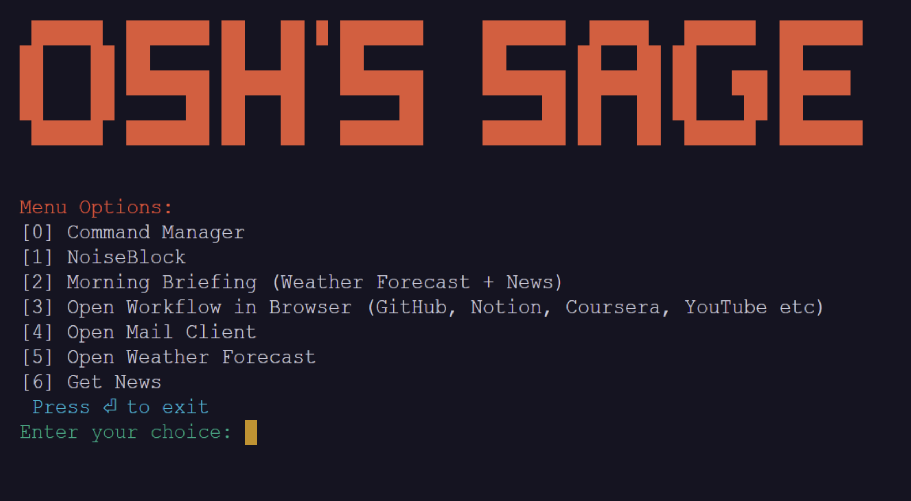

<h1 align="center">CommandSage 🪄</h1>  
<h2 align="center">A Python-based CLI Utility for Workflow Automation</h2>  

🚀 **Overview**

This Python command-line interface (CLI) startup tool is a personal project that you can use to streamline your daily tasks and automate various workflows. It's designed to be simple and extensible, allowing you to create and manage your own custom workflows. While the tool comes with five prebuilt workflows, its real power lies in its ability to adapt to your specific needs.



> 📌 **Note**
> 
> This tool is a personal project created by the author for their own use. It is shared on GitHub to inspire and assist others in creating their own customized CLI startup tools. Enjoy automating your daily tasks with this tool! 🤖

📦 **Features**

- **Prebuilt Workflows**: The tool comes with five prebuilt workflows out of the box, including opening websites, checking the weather forecast, opening a mail client, and fetching the latest news.

- **Custom Workflow Manager**: You can create and manage your own custom workflows using the "Command Manager" option. This allows you to automate your unique tasks and commands.

- **User-Friendly Menu**: The CLI presents a user-friendly menu with options for running prebuilt workflows, managing custom workflows, and exiting the tool.

💡 **Getting Started**

1. **Clone the Repository**: Start by cloning this repository to your local machine.

   ```
   git clone [https://github.com/yourusername/cli-startup-tool.git](https://github.com/NotSooShariff/CommandSage.git)
   cd CommandSage
   ```

2. **Prerequisites**: Make sure you have Python 3 installed on your system. And then use the following command to install pip dependencies:

    ```python
    pip install os requests sys
    ```

3. **Customise it**: Grab an API key from [NewsAPI](https://newsapi.org/) if you want the grabbing latest news functionality. And edit it in the `boot.py` by replacing the hashes in `NEWS_API_KEY = '###################'`. You can also make a [Custom Banner Art](https://patorjk.com/software/taag/#p=display&f=Graffiti&t=Type%20Something%20) when it starts up instead of `Osh's Sage` displayed right now.  

3. **Run the Tool**: To run the CLI tool, simply execute the main Python script:

   ```
   python boot.py
   ```

   This will launch the tool and present you with the main menu.

4. **Use Prebuilt Workflows**: You can choose from the prebuilt workflows directly from the menu. These include options to open websites, check the weather, and more.

5. **Create Custom Workflows**: To create custom workflows, select the "Command Manager" option from the menu. This will allow you to define your own commands and workflows.

6. **Add to .bashrc / .zhrc (Optional)**: To make the tool run on startup, you can add the following line to your `~/.bashrc` file:

   ```
   alias mystartup="python /path/to/boot.py"
   mystartup
   ```

   This creates an alias `mystartup` that automatically launches every time you start the terminal or you can run the alias from your terminal to launch the tool.

🛠️ **Command Manager**

The "Command Manager" is where you can create and manage your custom workflows. Here's how it works:

- **Display Command Flows**: View a list of your existing custom workflows.

- **Add Command Flow**: Create a new custom workflow by specifying a name and a list of commands.

- **Delete Command Flow**: Delete an existing custom workflow.

- **Execute Command Flow**: Run a specific custom workflow, optionally providing input values.

📝 **Example Usage**

Here's an example of how you can use the tool to simplify your daily tasks:

1. Use the prebuilt workflows to quickly access your favorite websites and check the weather forecast.
2. 

3. Create a custom workflow named "DailyReport" that runs a series of commands to generate a daily report. You can add this to the "Command Manager."

4. Add the tool to your `~/.bashrc` file to have it automatically launch on startup.

🚧 **Limitations**

- The tool currently supports only five prebuilt workflows, but it can be easily extended by adding more options in the main menu.

- The "Command Manager" functionality is basic and doesn't provide advanced features like conditional logic or error handling. It's intended for simple automation.

👨‍💻 **Contribution**

This tool is a personal project, but contributions and improvements are welcome. If you have ideas for enhancing its functionality or making it more user-friendly, feel free to submit pull requests.
